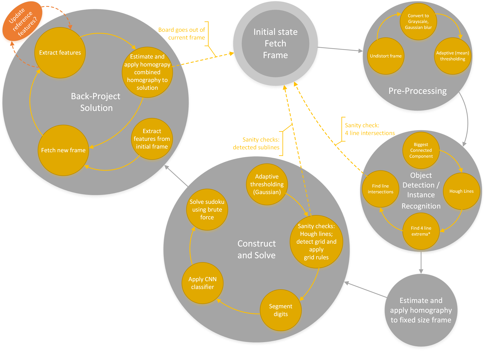

# SudoGuru
This project implements a realtime Sudoku solver using OpenCV library. The project is my response to the computer vision assignment at the University of Oslo. 

## Program flow 
Below is an drawing of the program's state diagram. 


## Instructions
Before you compile, you might want to select a different camera than default (0). The camera id is defined in `sudoguru.hpp`.
1.  This program depends on OpenCV 3.3.0 or later (I use 3.4.1); so head over to [opencv](https://github.com/opencv/opencv/) github and follow their instructions. 
2.  Build this project using CMake. Make sure you are in `src` directory when you build with cmake (i.e. create a `build` directory within `src`) as I have assumed that you are in src directory when I load the tensorflow graph definition `pb` file. Otherwise specify the relative path to a custom `pb` file (provided that you have specified a valid camera parameter file as first argument).
3.  (optional) In order to make the feature matching as best as possible, you need to provide an xml file containing camera calibration parameters (camera matrix, and distortion coefficients). To generate a calibration file, use opencv's interactive calibration tool:
```
opencv_interactive-calibration -ci=0 -t=chessboard -sz=30 -w=8 -h=5 –pf=cameraParameters.xml
```
In order to run this tool, you need to print the [chessboard](https://github.com/opencv/opencv/blob/master/samples/data/chessboard.png) (you can find it under /path/to/your/opencv/samples/data/chessboard.png) and tape it to a rigid flat surface. Make sure you get the margins of the printed image correct; the resulting chessboard squares should be 30x30mm, otherwize adjust the `-sz` parameter above accordingly.
Put the file in the parent directory of your build directory, or specify relative path as first argument when starting the program.
