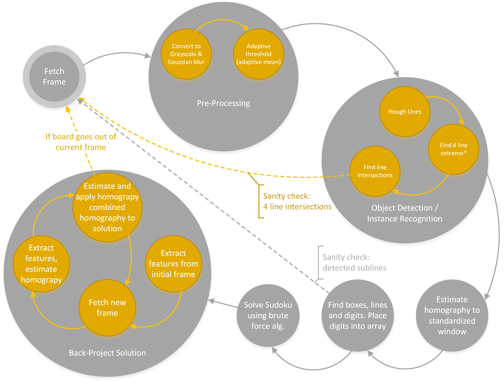

# Ide brainstorming

### Session 3: 

Endelig fått opp programskjelett og testet ulike metoder. Av metoder som er aktuelle å implimentere ved en senere annledning: 
1. Harris floodfill for brett deteksjon. Hver harris punkt, gjør floodfill, og inkrementerer stemme for (nærmeste binære 255) region i det segmenterte bildet tilsvarende cv::connectedcomponents() må muligens ha 3 bilder: segmenterte (input) bilde, connected component id bilde, og connected component stemmer; eventuelt ha sistnevnte som en `std::vector<cv::Vec3i>` (må bruke cv::mixChannels())


#### Inspirasjon?: 
http://aishack.in/tutorials/sudoku-grabber-opencv-detection/

### Session 2:
#### Mulig programflyt: 
```
(0. Preprosessering adaptiv kontrastutjevning)
1. Sudoku objekt detektor<--+
                       |    | (loop)
                       |    |
                       |----+
                       V
2. Estimer homografi og segmenter bilde til boundingbox (inspirasjon fra opencv's
   cvFindChessBoard()?)
                       |
                       |
                       |
                       V
3. Ekstraher bokser, og finn inneholdene tal f. eks. vha. normalisert 
   krysskorrelasjon (template-matching) med generiske tall eller deep learning?. 
                       |
                       |
                       |
                       V
4. Løs sudoku (brute force metode allerede implimentert i Java fra INF1010)
                       |
                       |
                       V
5. Snapshot rammen og ekstraher features f. eks. SIFT/Harris
                       |
                       |
                       |
                       V
6. +<--------------------------------------+
   | Re-estimer homografi fra låst til nå-  | (loop)
   | værende ramme. (RANSAC og DLT)        |
   | Projisèr template løsning til verden  | 
   | ved å bruke de to estimerte           |-----> Gå til 1 dersom RANSAC
   | homografiene ovenfor                   |       ikke gir nok innliere
   +-------------------------------------->+
```
### Session 1:
Sudoku solver augmented reality:

Implimentere en sudoku instans detektor som finner steder i bildet hvor mulige sudokubrett befinner seg. 
Finne homografi som mapper sudokuoverflate til normalplan
Finn en bounding box rundt brettet f. eks. vha. keypoint features, og "hallusiner" eventuelle manglende features
  kanskje kombinere hough-transform over featurepoints i.e. gjør houghtransform over canny bilde, men bare i feature points og bruke regelen med 9x9 ruter -> 10x10 linjer hvorav 4 typisk er mye tykkere (lettere og detektere). 
  I første omgang kan det være nok å finne en tett boks rundt rammen på brettet, og så transformere brettet (homografi) til normalplanet; og så finne alle linjer deretter ved å gjøre ny canny + haar (kan organiseres i en pipeline av tråder). 

I første omgang kan det være et stort steg å kommet hittil å prøve å projisere en blank ramme ved (type
transformere en ufullt ramme på den detekterte sudokuramma) når dette er gjort kan rammen fylles ved å bruke
f. eks. 32x32 templates av tall (Comic Sans. :) 

for å detektere forhåndsskrivne tall, bruker en template matching på det "normaliserte brettet", skalèr brettet slik at rutene er ~32x32, og bruk generisk templatematching over vinduene med å bruke svakt blurede templates, og normaliser med template sumen. gjør gjerne over flere offsets og klassifisèr til max. 


Så til slutt kan vi forke en ny java prosess som eksekeverer (en modifisert versjon av) Sudokusolver fra 2. semester BCs (eller bare implimentere selv).

Hvis dette skulle vise seg å være særdeles enkelt, kan mer avanserte metoder utforskes; Hough Transform? Multi threading? Kan vi rettferdiggjøre stereo (annet en mer robust feature-matching {hadde vert kult :]})? 
